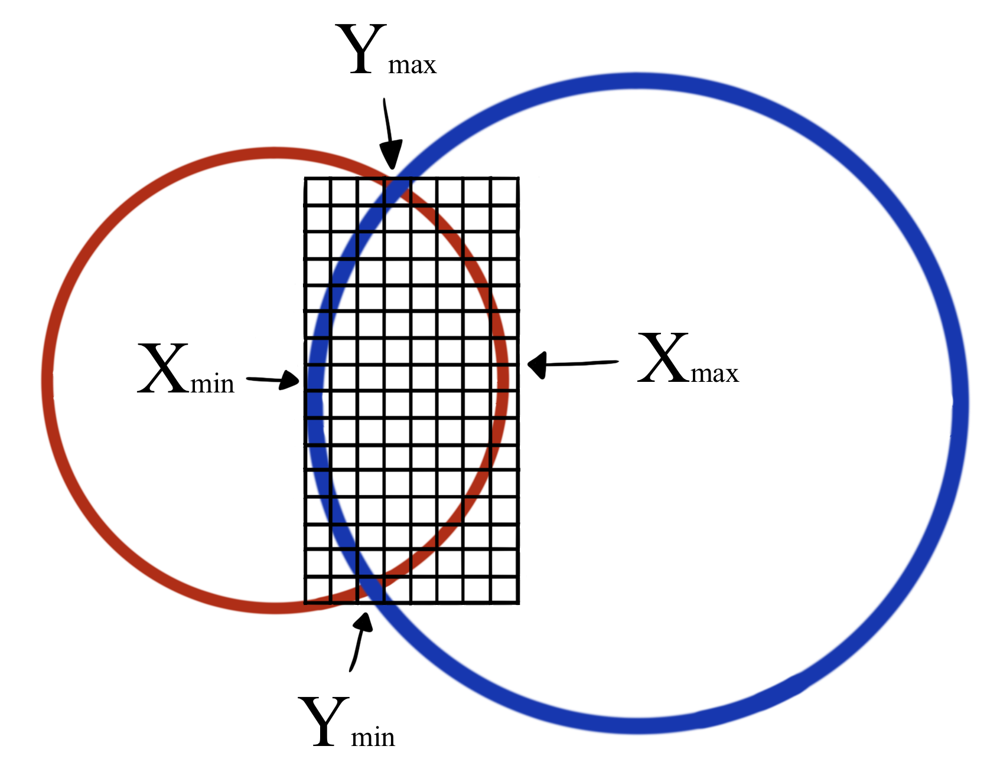

# MDPI Crystals: by Almat Yeraly and Dr. Diana Schepens

### Example: How to run the code to calculate the overlap volume of 2 Molecules

```cpp
#include <iostream>
#include "Functions.h"

using std::cout;
using std::endl;

int main(){
    
    // set grid cube size
    // smaller cube sizes give more accurate results and take longer to run
    double cube = 0.1;

    // read molecule files
    Molecule m1 = read_molecule("/file_path_to_molecule1.pdb");
    Molecule m2 = read_molecule("/file_path_to_molecule2.pdb");

    // calculate volumes
    double m1_m2_overlap_vol = get_overlap_volume(m1, m2, cube); // calculate overlap volume of 2 molecules
    double m1_vol = get_overlap_volume(m1, m1, cube); // calculate volume of molecule 1 by overlapping with itself
    double m2_vol = get_overlap_volume(m2, m2, cube); // calculate volume of molecule 2 by overlapping with itself
    
    // output individual volumes
    cout << "Overlap vol: " << m1_m2_overlap_vol << endl;
    cout << "Molecule 1 vol: " << m1_vol << endl;
    cout << "Molecule 2 vol: " << m2_vol << endl;
    
    // output overlap percentage
    cout << "Overlap vol % relative to Molecule 1: " << m1_m2_overlap_vol/m1_vol << endl;
    cout << "Overlap vol % relative to Molecule 1: " << m1_m2_overlap_vol/m2_vol << endl;

    
    return 0;
}

```
This will output in the following format:
```
Overlap vol: 205.849
Molecule 1 vol: 225.259
Molecule 2 vol: 206.771

Overlap vol % relative to Molecule 1: 0.913833
Overlap vol % relative to Molecule 1: 0.995541
```

### Visual Explanation of the Algorithm: Step-by-step breakdown

*For the sake of simplicity, we are using 2D images. A circle represents a sphere, which represents an Atom.*

Let's imagine a situation where we want to find the general overlap area between 2 molecules. Let Molecule 1 be the red circle and Molecule 2 be the blue circles. Both of the molecules are located in a 3D space, and the coordinates of the centers and radii of each circle are given.

#### Step 1

<p align="center">
  
</p>


The first step is to identify pairs of atoms that overlap. In our example, the red circle overlaps with both blue circles. Hence, our pairs are: **(red, larger blue)** and **(red, smaller blue)**.

#### Step 2

<p align="center">
  
</p>

Next, the grid is formed around the overlap area of the first pair. Using simple geometry, the coordinates for X<sub>min</sub>, X<sub>max</sub>, Y<sub>min</sub>, Y<sub>max</sub> are calculated. In a 3D space, it is also possible to calculate Z<sub>min</sub>, Z<sub>max</sub>.
- [This article](https://mathworld.wolfram.com/Circle-CircleIntersection.html) and [this Github repository](https://github.com/benfred/bens-blog-code/tree/master/circle-intersection) were used as references to calculate X<sub>min</sub>, X<sub>max</sub>, Y<sub>min</sub>, Y<sub>max</sub>. 
- [This article](http://www.ambrsoft.com/TrigoCalc/Sphere/TwoSpheres/Intersection.htm) explains how to find the equation of a 2D circle that goes through the intersection points of 2 spheres. After finding the center of the intersection circle, we added and subtracted the radius of the smaller sphere to calculate Z<sub>min</sub>, Z<sub>max</sub>, thus forming a grid in a 3D space.

#### Step 3

<p align="center">
  
</p>

The grid is then iterated through to calculate the distance from the center of each square to the centers of both circles. To identify whether a square is inside the overlap area, the distance to the center of circle 1 needs to be smaller than the radius of circle 1 **AND** the distance to the center of circle 2 needs to be smaller than the radius of circle 2. If a square is in the overlapping area, the coordinates of the center of the square are added to a list that tracks all overlapping squares.

#### Step 4

<p align="center">
  
</p>

The same process is repeated with the next pair of overlapping Atoms. 

#### Step 5

All lists that contain coordinates of all overlapping squares are then combined to a single list. Notice that there are overlapping squares in second pair that were also present in the first pair, those squares are not duplicated in the final list.


#### Step 6
<p align="center">
  
</p>

In the end, it is known how many squares are inside the general overlap area. Thus, summing the areas of all overlapping squares gives an estimate of the general overlap area.
